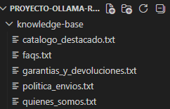
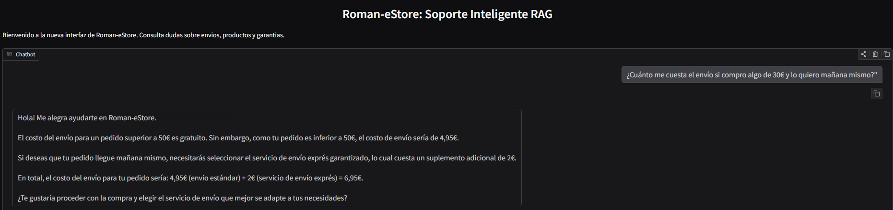
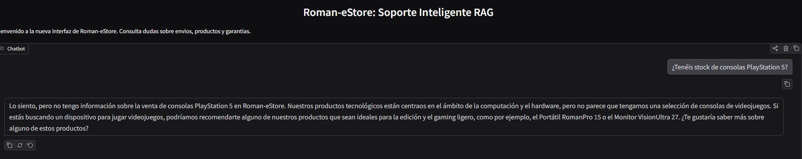
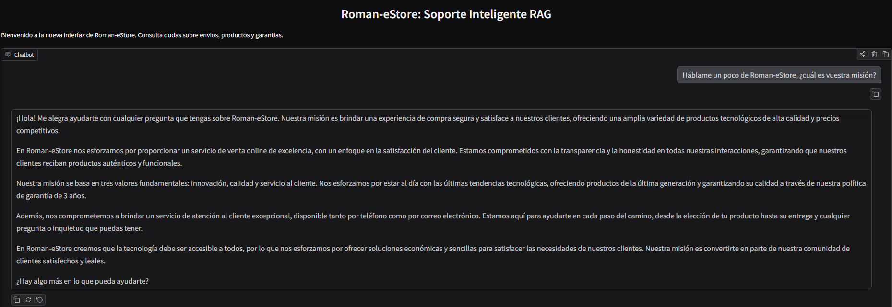

# Roman-eStore: Soporte Inteligente con IA (RAG)

**Autor:** Román Muñoz Soto  
**Curso:** 2025-2026  
**Actividad:** 9 - Implementación de un sistema RAG (Remake Actividad 4)

## 1. Descripción del Dominio
**Roman-eStore** es una tienda especializada en tecnología y componentes informáticos. El objetivo de este proyecto es ofrecer un asistente virtual que no solo charle, sino que responda basándose en la documentación oficial de la tienda sobre productos, garantías y logística.

## 2. Base de Conocimiento (Knowledge Base)
Para alimentar al sistema, se han creado 5 archivos de texto en la carpeta `knowledge-base/`:
* **faqs.txt**: Horarios y dudas comunes.
* **politica_envios.txt**: Costes (gratis > 50€) y suplemento exprés.
* **garantias_y_devoluciones.txt**: Información sobre los 3 años de garantía.
* **quienes_somos.txt**: Historia y valores de la empresa.
* **catalogo_destacado.txt**: Detalles técnicos de productos estrella.



## 3. Pipeline RAG Implementado
El sistema sigue un flujo de trabajo de Generación Aumentada por Recuperación:
1. **Indexación**: El script lee los archivos `.txt`, los divide en fragmentos y genera embeddings usando el modelo `nomic-embed-text`.
2. **Almacenamiento**: Los vectores se guardan en una base de datos **ChromaDB** persistente (`roman_estore_db`).
3. **Recuperación (Retrieval)**: Cuando el usuario pregunta, el sistema busca los fragmentos más similares semánticamente.
4. **Generación**: Se envía el contexto recuperado a **Llama 3.2** para que redacte la respuesta final.

## 4. Pruebas y Validación del Sistema
Se han realizado pruebas específicas para verificar la precisión del asistente y su capacidad de recuperación de datos:

### A. Lógica de Negocio (Envíos y Costes)
El sistema identifica correctamente que un pedido de 30€ no llega al mínimo de 50€ para envío gratuito y aplica el coste de 4,95€, sumando además el suplemento de 2€ por el servicio exprés solicitado.


### B. Control de Alucinaciones (Robustez)
Al preguntar por productos inexistentes en el catálogo (como una PS5), el asistente demuestra robustez al no inventar información, confirmando que se ciñe exclusivamente al contexto proporcionado.


### C. Identidad Corporativa (Misión y Valores)
El asistente recupera con éxito la información sobre la empresa, respondiendo preguntas sobre la historia y valores de Roman-eStore de forma coherente.


## 5. Instrucciones de Ejecución
1. **Requisitos de Ollama**: Asegurarse de tener los modelos `llama3.2` y `nomic-embed-text` descargados (`ollama pull`).
2. **Instalación de dependencias**:
   ```bash
   py -m pip install chromadb gradio requests
3. **Lanzamiento**: Ejecutar el script principal para iniciar la base de datos y la interfaz:
    py app.py
4. **Acceso**: Abrir en el navegador la URL local proporcionada por Gradio (normalmente http://127.0.0.1:7860).